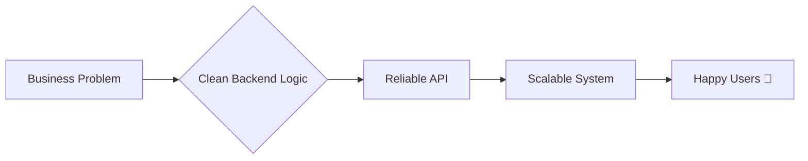

## 🚀 Hi, I'm Quang Thieu

### `Backend Developer in the making` — turning coffee ☕ into APIs since 2022

<br/>

```
> whoami
Đoàn Quang Thiệu — 4th-year Software Engineering student
Building things on the server-side, breaking things on purpose to learn
```

---

### ⚡ Quick Facts

- 🎓 **Year 4** · Software Engineering · Information Technology
- 🎯 Chasing a career as a **Backend Developer**
- 🧠 Obsessed with clean APIs, solid databases & systems that don't fall over
- 🌱 Currently leveling up in **system design** & **cloud basics**
- 🌎 Vietnam-based, internet-native
- 💬 Vietnamese (native) · English (working)

---

### 🛠️ Tech Arsenal

**Languages**


**Backend & Frameworks**


**Databases**


**DevOps & Tools**


**Frontend (just enough to ship a demo)**


---

### 🔥 What I'm Building & Learning

| 🚧 Right now | 🧭 Next up |
|---|---|
| RESTful API design & best practices | Microservices architecture |
| Database optimization & indexing | Message queues (Kafka / RabbitMQ) |
| Authentication & authorization patterns | Cloud fundamentals (AWS / GCP) |
| System design fundamentals | CI/CD pipelines |

---

### 🎯 The Mission



I want to be the dev who turns messy requirements into **APIs that just work** — fast, secure, and built to scale.

---

### 📊 GitHub Stats

<p align="center">
  
  
</p>

<p align="center">
  
</p>

---

### 📫 Let's Connect

[](https://www.linkedin.com/in/thi%E1%BB%87u-%C4%91o%C3%A0n-674580315/)
[](mailto:doanquangthieu9c@gmail.com)
[](https://github.com/thieuat7)

---

<p align="center">⭐ <i>Always down to talk backend architecture, databases, or your next side project.</i></p>
